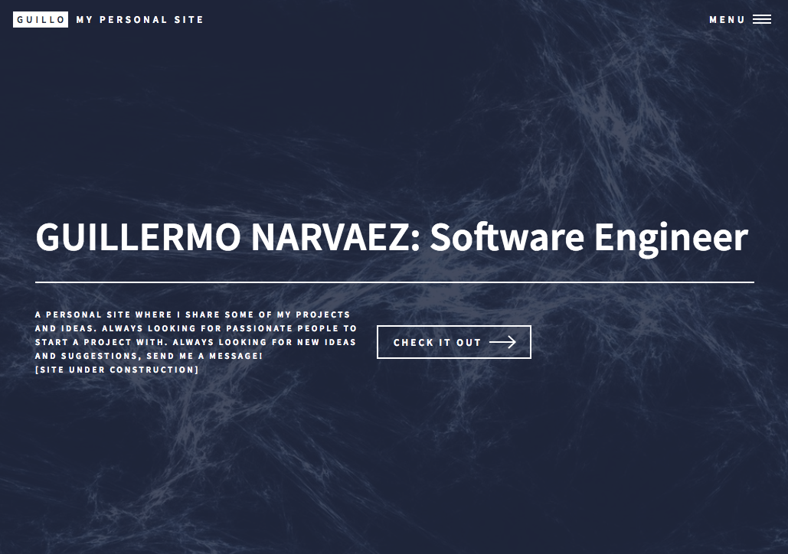

# Coding a Personal Site (guillonapa.github.io)

Personal website that I built using a library from HTML5 UP. The site has software development projects, photographic projects, some of my Physics research, and other interesting things that I've done. This is a work in progress.

### Purpose

The purpose of this project is to have a place where I can show a little of who I am, while having the opportunity to practice the languages, tools, and practices that I have learned. This site is the result of looking at online resources and tutorials, which helped me learn something about HTML structuring, CSS styling, and JavaScript usage. With this project I also had to learn how to use GitHub, and I was exposed to the first time ever to source control (even though now I realize how far this is from real practice... specially since this is a one-person project).

This project, however, really helped me become more comfortable with learning about development tools, libraries, and languages. The site is still UNDER CONSTRUCTION... even though this was a project I started about 6 months ago, but some of the sections have content (including the Software Development section). Take a look!

[https://guillonapa.github.io/](https://guillonapa.github.io/)

